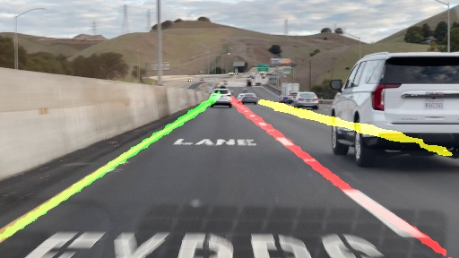
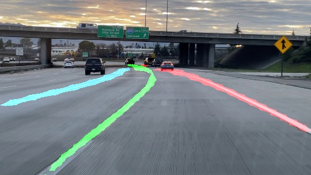

# Remaster of SCNN and ENet-SAD in Pytorch

SCNN is a lane detection algorithm, proposed in ['Spatial As Deep: Spatial CNN for Traffic Scene Understanding'](https://arxiv.org/abs/1712.06080). The [official implementation](<https://github.com/XingangPan/SCNN>) is in lua torch.

ENet-SAD is the lightest algorithm proposed in ['Learning Lightweight Lane Detection CNNs by Self Attention Distillation'](https://arxiv.org/abs/1908.00821). The [official implementation](<https://github.com/cardwing/Codes-for-Lane-Detection>) is in lua torch too.

This repository contains a re-master version in Pytorch.


### Updates

- 03-14-2021: Remastered SCNN in PyTorch.
- 03-15-2021: Updated the test and demo codes to adaptive to TuSimple dataset.
- 03-16-2021: Remastered ENET-SAD in PyTorch.
- 03-17-2021: Meged sccn and enet_sad into one training and testing script.
- 03-18-2021: Uploaded the pre-trained model.

<br/>

## Data preparation

### Tusimple
Download dataset is from [here](https://github.com/TuSimple/tusimple-benchmark/issues/3). Please download and unzip the files in one folder, which later is represented as `Tusimple_path`. Then modify the path of `Tusimple_path` in `config.py`.
```
Tusimple_path
├── clips
├── label_data_0313.json
├── label_data_0531.json
├── label_data_0601.json
└── test_label.json
```

**Note:  seg\_label images and gt.txt, as in CULane dataset format,  will be generated the first time `Tusimple` object is instantiated. It may take some extra time.**


<br/>

## Pre-trained Model

* Trained model on TuSimple can be downloaded [SCNN](https://drive.google.com/file/d/1grNvmVZVq70YSWl0lnEFhntGiuQ_ag1n/view?usp=sharing) and [ENet_SAD](https://drive.google.com/file/d/1b1j-8jzApF4P7czVKlAzJPPa6DnHlRTn/view?usp=sharing). Its configure file is in `experiment/scnn`.

|   Model  | Accuracy |   FP   |   FN   |
| -------- | -------- | ------ | ------ |
|   SCNN   |  94.16%  | 0.0735 | 0.0825 |
| ENET-SAD |  96.64%  | 0.0602 | 0.0205 |

<br/>


## Demo Test

For single image demo test:

```shell
python demo_image.py -m scnn 
                     -i image/sample1.jpg 
                     -e experiments/scnn 
                     -w experiments/scnn/scnn.pth
python demo_image.py -m enet_sad 
                     -i image/sample1.jpg 
                     -e experiments/enet_sad 
                     -w experiments/enet_sad/enet_sad.pth
```
The result is located under ./image folder.






For customized video demo:
```
python demo_video.py -i video/demo1.MOV -w experiments/scnn/scnn.pth -e experiments/scnn/ -v
```

[Video Demo1](https://user-images.githubusercontent.com/14226287/111417407-0a910700-86a3-11eb-9609-98db5cf40535.mov)
[Video Demo2](https://user-images.githubusercontent.com/14226287/111417761-c0f4ec00-86a3-11eb-8e14-36381f51e358.mov)


<br/>

## Train 

1. Specify an experiment directory, e.g. `experiments/scnn` or `experiments/sad`. 

2. Modify the hyperparameters in `experiments/scnn/modle_config.json`.

3. Start training:

   ```shell
   python train_tusimple.py --model scnn --exp_dir ./experiments/scnn [--resume/-r]
   python train_tusimple.py --model enet_sad --exp_dir ./experiments/enet_sad  [--resume/-r]
   ```

4. Monitor on tensorboard:

   ```bash
   tensorboard --logdir='experiments/scnn'
   tensorboard --logdir='experiments/enet_sad'
   ```

**Note**


- Modify the model trainer according to your hardware configuration.
- Using the backbone is vgg16 from torchvision. Several modifications are done to the torchvision model according to paper, i.e., i). dilation of last three conv layer is changed to 2, ii). last two maxpooling layer is removed.


<br/>

## Evaluation

* Tusimple Evaluation code is ported from [tusimple repo](https://github.com/TuSimple/tusimple-benchmark/blob/master/evaluate/lane.py).

  ```Shell
  python test_tusimple.py --model scnn --exp_dir ./experiments/scnn
  ```


## Acknowledgement

This repos is build based on [official implementation](<https://github.com/XingangPan/SCNN>) and [ENet-SAD](<https://github.com/InhwanBae/ENet-SAD_Pytorch>).
