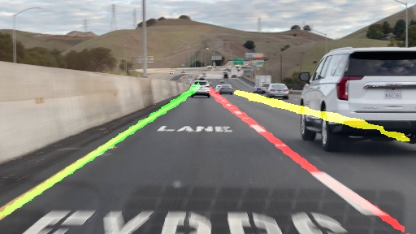
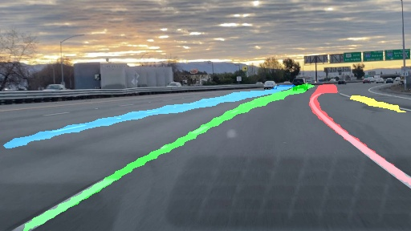

# Remaster of SCNN and ENET-SAD in Pytorch

SCNN is a lane detection algorithm, proposed in ['Spatial As Deep: Spatial CNN for Traffic Scene Understanding'](https://arxiv.org/abs/1712.06080). The [official implementation](<https://github.com/XingangPan/SCNN>) is in lua torch.

This repository contains a re-master version in Pytorch.


### Updates

- 03-14-2021: Remastered SCNN in PyTorch.
- 03-15-2021: Updated the test and demo codes to adaptive to TuSimple dataset.
- 03-16-2021: Remastered ENET-SAD in PyTorch.

<br/>

## Data preparation

### Tusimple
Download dataset is from [here](https://github.com/TuSimple/tusimple-benchmark/issues/3). Please download and unzip the files in one folder, which later is represented as `Tusimple_path`. Then modify the path of `Tusimple_path` in `config.py`.
```
Tusimple_path
├── clips
├── label_data_0313.json
├── label_data_0531.json
├── label_data_0601.json
└── test_label.json
```

**Note:  seg\_label images and gt.txt, as in CULane dataset format,  will be generated the first time `Tusimple` object is instantiated. It may take some extra time. Pretrained model can be downloaded from [here](https://drive.google.com/file/d/1_nmyBERjUFY8HmE-RMujK-9bvx_2cRL4/view?usp=sharing)**


<br/>

## Pre-trained Model

* Trained model on TuSimple can be downloaded [here](https://drive.google.com/open?id=1IwEenTekMt-t6Yr5WJU9_kv4d_Pegd_Q). Its configure file is in `exp0`.

| Accuracy | FP   | FN   |
| -------- | ---- | ---- |
| 94.16%   |0.0735|0.0825|


<br/>


## Demo Test

For single image demo test:

```shell
python demo_tusimple.py   -i image/sample1.jpg 
                          -w experiments/scnn/scnn.pth
```
The result is located under ./image folder.





<br/>

## Train 

1. Specify an experiment directory, e.g. `experiments/scnn` or `experiments/sad`. 

2. Modify the hyperparameters in `experiments/scnn/modle_config.json`.

3. Start training:

   ```shell
   python train_tusimple.py --exp_dir ./experiments/scnn [--resume/-r]
   ```

4. Monitor on tensorboard:

   ```bash
   tensorboard --logdir='experiments/scnn'
   ```

**Note**


- My model is trained with `torch.nn.DataParallel`. Modify it according to your hardware configuration.
- Using the backbone is vgg16 from torchvision. Several modifications are done to the torchvision model according to paper, i.e., i). dilation of last three conv layer is changed to 2, ii). last two maxpooling layer is removed.


<br/>

## Evaluation

* Tusimple Evaluation code is ported from [tusimple repo](https://github.com/TuSimple/tusimple-benchmark/blob/master/evaluate/lane.py).

  ```Shell
  python test_tusimple.py --exp_dir ./experiments/scnn
  ```


## Acknowledgement

This repos is build based on [official implementation](<https://github.com/XingangPan/SCNN>) and [ENet-SAD](<https://github.com/InhwanBae/ENet-SAD_Pytorch>).
